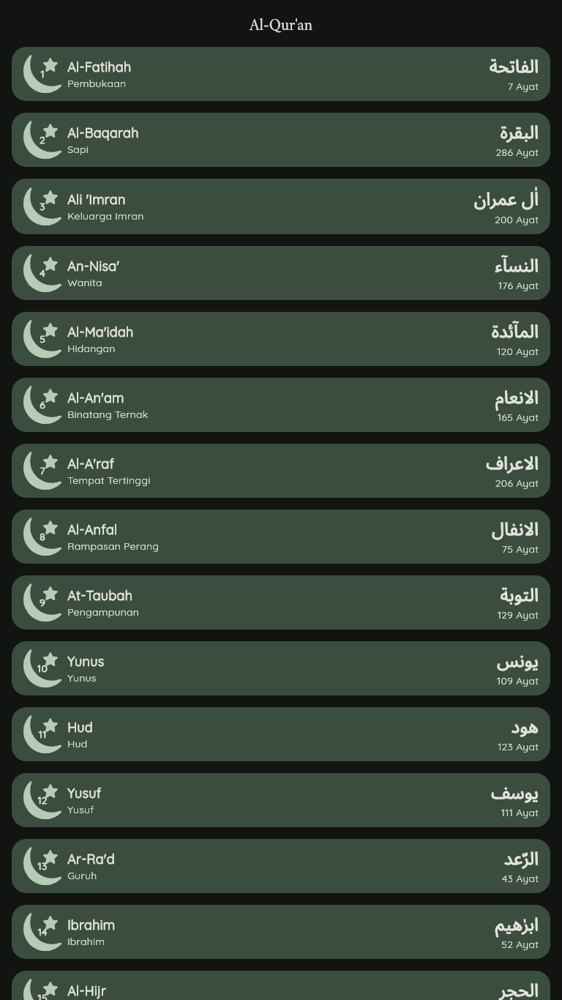
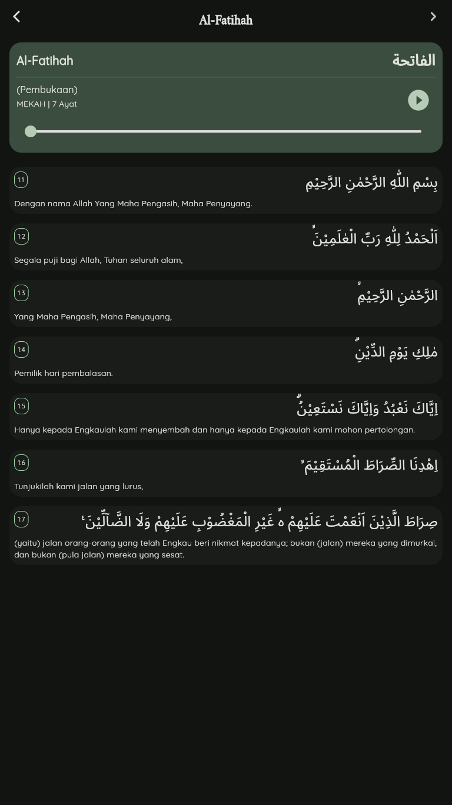
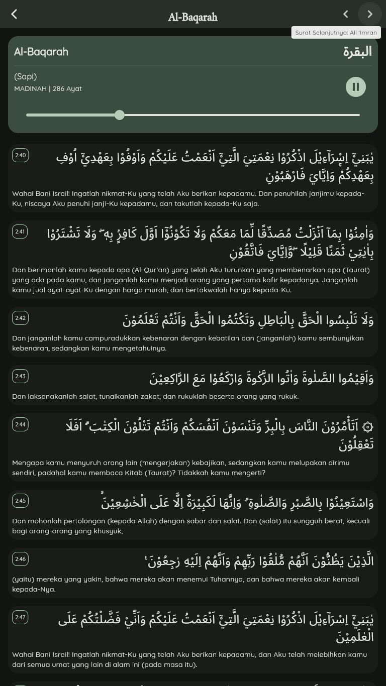

```markdown
# 📖 Al-Qur'an Mobile

A modern Al-Qur'an application built with **Flutter**, designed to provide a seamless reading and listening experience. This project implements a **Clean Architecture** (Layer-First) approach to ensure scalability and maintainability.


## 📸 Screenshots

| Home Page (Light) | Detail Surah | Audio Player |
|:-----------------:|:------------:|:------------:|
|  |  |  |
## ✨ Features

* **Surah Index:** View a complete list of 114 Surahs with their revelation type (Meccan/Medinan) and verse count.
* **Smart Navigation:** Easily navigate between **Previous** and **Next** Surahs directly from the details page.
* **Reading View:** Clean and readable Arabic script with Indonesian translation.
* **Audio Recitation:** Listen to high-quality audio recitation for each Surah (powered by `just_audio`).
* **Interactive Player:** Play, pause, and seek through the audio recitation with a responsive slider.
* **Dark/Light Mode:** Automatically adapts to system theme preferences using Material 3.
* **Responsive Design:** Optimized for Android, iOS, and Web.

## 🛠 Tech Stack

* **Framework:** Flutter & Dart
* **Architecture:** Layer-First (Clean Architecture)
* **State Management:** `setState` (Native)
* **Networking:** `Dio` (with Interceptors & Timeouts)
* **Error Handling:** `either_dart` (Functional Programming approach)
* **Audio:** `just_audio`
* **Fonts:** `google_fonts` (Quicksand & Amiri Quran)
* **UI Assets:** `flutter_svg`

## 📂 Project Structure

This project follows a clean, organized directory structure:

```text
lib/
├── core/                   # Core configurations
│   ├── constants/          # App constants (API URLs, etc.)
│   ├── theme/              # Material 3 Theme Configuration
│   └── utils/              # Helper functions
│
├── data/                   # Data Layer
│   ├── models/             # Data Models (JSON Parsing)
│   │   └── details/        # Specific models for detail page
│   └── services/           # Remote Data Fetching (Dio)
│
├── presentation/           # UI Layer
│   ├── pages/              # Application Screens
│   │   ├── home/           # Home Screen Logic
│   │   └── details/        # Detail Screen Logic
│   │       └── widgets/    # Local Widgets (SurahHeader, AyatItem)
│   │
│   └── widgets/            # Reusable Global Widgets (SurahCard)
│
└── main.dart               # Entry Point

```

## 🚀 Getting Started

Follow these steps to run the project locally.

### Prerequisites

* Flutter SDK installed ([Guide](https://docs.flutter.dev/get-started/install))
* VS Code or Android Studio

### Installation

1. **Clone the repository**
```bash
git clone [https://github.com/Nora_Haru/al-quran-mobile.git](https://github.com/Nora_Haru/al-quran-mobile.git)
cd al-quran-mobile

```


2. **Install dependencies**
```bash
flutter pub get

```


3. **Run the app**
```bash
flutter run

```


### ⚠️ Running on Web (CORS Issue)

If you are running this app on a **Web Browser (Chrome)** during development and facing `XMLHttpRequest` or `DioException` errors, it might be due to CORS policy on the API.

To fix this temporarily, run the following command in your terminal:

```bash
flutter run -d chrome --web-browser-flag "--disable-web-security"

```
But, if you are not facing this errors, you're good to go.

## 🔗 API Reference

This app utilizes the public API provided by **Open API**:

* Base URL: `https://open-api.my.id/api/`
* Endpoint: `quran/surah`

## 📚 Resources & Credits

This project was developed based on the comprehensive tutorial by **SantriKoding**. Special thanks to the original author **hunt3r6** for the high-quality guide and source code.

While following the tutorial, this project has been enhanced with:
* **Clean Architecture** (Layer-First) implementation.
* **Dio** & **Either** for robust networking and error handling.
* **Just Audio** for advanced audio playback control.
* **Previous/Next Navigation** logic.

**References:**
* **Tutorial Source:** [Tutorial Membuat Aplikasi Al-Quran dengan Flutter - SantriKoding](https://www.santrikoding.com/tutorial-set/tutorial-membuat-aplikasi-al-quran-dengan-flutter)
* **Original Repository:** [hunt3r6/flutter-alquran](https://github.com/hunt3r6/flutter-alquran)

## 🤝 Contributing

Contributions are always welcome!

1. Fork the project
2. Create your Feature Branch (`git checkout -b feature/AmazingFeature`)
3. Commit your Changes (`git commit -m 'Add some AmazingFeature'`)
4. Push to the Branch (`git push origin feature/AmazingFeature`)
5. Open a Pull 

```

```